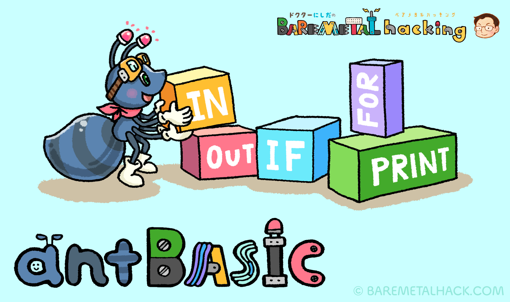
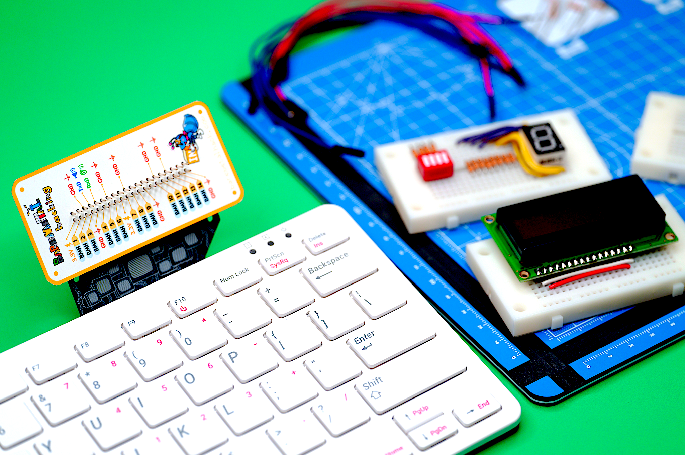
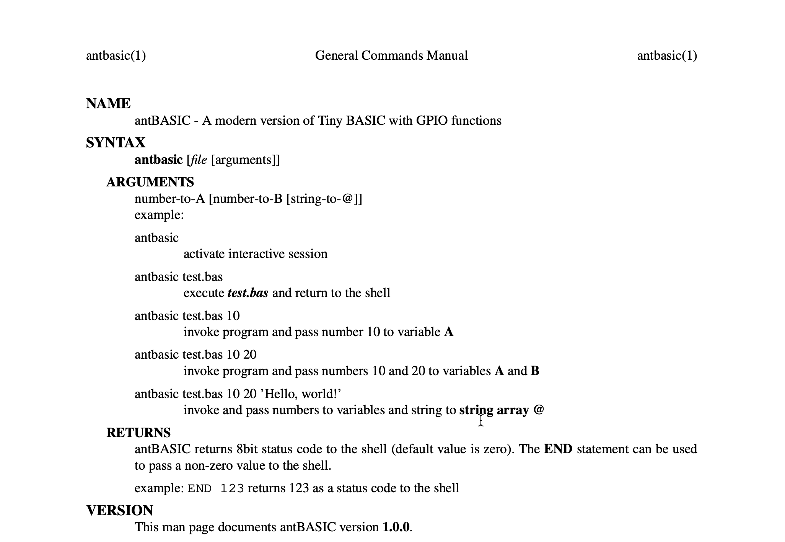

# antBASIC
## 🎁 A modern version of Tiny BASIC with enhancements for the Rasberry Pi


**antBASIC** is a modernized version of **Tiny BASIC**, with the addition of I/O manipulation instructions specifically designed for the **Raspberry Pi**. Although the language specification is minimal, beginners can learn the basics of programming, and a wide range of I/O controls through antBASIC.
## 😍 Bare Metal Hacking (BMH) on the Breadboard


**antBASIC** is a product of the **BMH project**. BMH is an abbreviation for **Bare Metal Hacking**, which aims to teach the basics of **system programming** by controlling bare LEDs, LCDs, ICs, MCUs, etc., on a **breadboard**. I designed antBASIC as an introductory computer language for **I/O control** running on the **Raspberry Pi**. It is the 21st-century version of Tiny BASIC for beginners.
## 🚀 BMH Style GPIO Card


The Raspberry Pi has a 40-pin external header which holds **27 GPIO pins**. Since the order of the original PINs (https://pinout.xyz/#) is **irregular**, it is easy to make mistakes when wiring. From an educational perspective, BMH has assigned **new consecutive numbers (BMH1 to BMH14)** to the GPIO pins. Although the number of pins is about half, **14**, you can enjoy almost any I/O control!

BMH provides an easy-to-understand **BMH GPIO card** for beginners ([bmh-gpio-cards.pdf](./DOCUMENTS/bmh-gpio-cards.pdf) in the DOCUMENTS 📂 directory).

## 🔧 Build and Install
> You need to pre-install **libreadline-dev**, **atp** and **ghostscript** (includes ps2pdf) packages before `make std` or `make max`.

#### Build applications
`$ make` 👉 **antbasic** and **antcalib**
#### Build applications and PDFs
`$ make std` 👉 antbasic, antcalib, **antbasic.pdf**, and **src.pdf**
#### Build applications, PDFs, and test applications
`$ make max` 👉 antbasic, antcalib, antbasic.pdf, src.pdf, **test_token**, **test_bcode**, **test_prog**, **test_eval**, **test_assign**
#### Install applications and man file
> You require **ROOT** privilege

`$ sudo make install` 👉 📂 /usr/local/bin/antbasic, 📂 /usr/local/bin/antcalib, 📂 /usr/local/share/man/man1/antbasic.1
#### Clean applications
`$ make clean` 👉 delete applications in the source tree
#### Dist-clean
> You require **ROOT** privilege

`$ sudo make dist-clean` 👉 purge all created files

## 🔠 Line editing by GNU Readline
Default Makefile builds an antBASIC binary linked with the [GNU Readline library](https://tiswww.case.edu/php/chet/readline/rltop.html). Readline makes editing commands and programs much more effortless. In addition, the filename completion is very powerful. For more information on editing and history functions, see [rluserman.pdf](./DOCUMENTS/rluserman.pdf) in the DOCUMENTS 📂 directory.

## ⏳ Adjust µ-second wait
There are two types of wait functions, **MSLEEP()** and **USLEEP()**, in antBASIC. The former is a delay in *seconds*, while the latter is in *micro-seconds*. By default, both functions use the *usleep system call* internally, but a delay in the order of micro-seconds can lead to time variability.

If more precise control in micro-seconds is required, set the **ANT_MICROWAIT** environment variable. Then the USLEEP() function does not use the usleep system call but uses a simple loop for the number of times specified by ANT_MICROWAIT.

**antcalib** is a utility for estimating the number of loops required for a μsec delay. The first argument specifies the number of loops, and the second argument specifies the number of loop calls.
```
$ ./antcalib 220 10000000
Loopcount = 220
Number of loops = 10000000

Elapsed time --> 10 sec 9327 usec
Mean time --> 1.000933 usec/loop
```
On a *Raspberry pi 400*, the loop count is around *220*. Once the loop count is determined, add the export command to the **~/.bashrc**.
```
export ANT_MICROWAIT=220
```

## 📖 man antbasic

You can find the usage and grammar of antBASIC in the man file. Enter the command `$ man antbasic` in a terminal or open [antbasic.pdf](./DOCUMENTS/antbasic.pdf) in the DOCUMENTS 📂 directory of the source tree.

## 🎰 Version
Initial revision **1.0.1** released on ___April 30rd, 2022___

## 📝 Author
Doctor BMH 🇯🇵  
Wataru Nishida, _M.D.🩺, Ph.D._ 🎓

## 👀 See Also
[🌐 BMH Home Page](https://baremetalhack.com/en.html)  
[📺 BMH YouTube Channel](https://www.youtube.com/channel/UCQGey9r62VuiZrTy74HMHAg)
